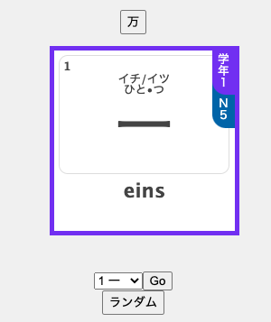
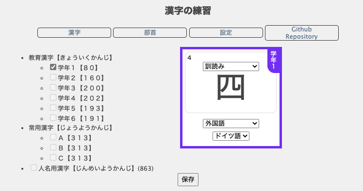

# kanji_practice
Flash cards for learning Kanji &amp; Radicals

Since I wasn't happy with any of the resources online for learning Japanese/practicing for the JLPT, I decided to make digital flash cards.  Since I've been doing web programming on and off since the late 1990s, I might as well put my (now, arguably) rusty PHP skills to the test.

Kanji cards include (optional) 訓読み &amp; onyomi, gradeschool level, JLPT level, (optional) translations, and stroke numbers. On the back (on mouse over, they flip), they include translations as well as 訓読み &amp; onyomi as furigana. 

(At the moment)the most common radicals are included as well. With furigana and examples, and on the back of the card is the translation.

Settings are "built in" so the front of the flash cards can be customised.  Options are available for language of the translations (between ドイツ語 and 英語, as well as 無し), whether or not ふりがな is wanted, and wether or not translations should be shown at all.  Safari currently has problems displaying furigana dropdrop in the correct position.

As the database is being filled out based on where I am learning Japanese &amp; Kanji, not all Kanji may be available yet. They should be added as I progress. At the moment, it is based on grade school levels, but I would like to add selections for the JLPT levels.

These pages were made using PHP and HTML only.  Instead of a MySQL databate, PHP classes are used.  Instead of cookies (to save settings), _GET URL variables are used.

Information has been collected from various websites, including: <a href="https://jlptstudy.net">jlptstudy.net</a>, <a href="https://de.wikipedia.org/">Wikipedia</a> (<a href="https://de.wikipedia.org/wiki/Kyōiku-Kanji">Kyōiku-Kanji (DE)</a>, <a href="https://en.wikipedia.org/wiki/List_of_kanji_radicals_by_frequency">List of Kanji radicals by frequency</a>), <a href="https://www.hadamitzky.de">www.hadamitzky.de</a>, and <a href="https://jisho.org">jisho.org</a>.

As always, because I believe in OpenSource, everything should be available (soon) on Github, so that anyone can use what I made to make their own flash cards (for whatever) and improve upon it, as this will not be the prettiest nor best code. 

